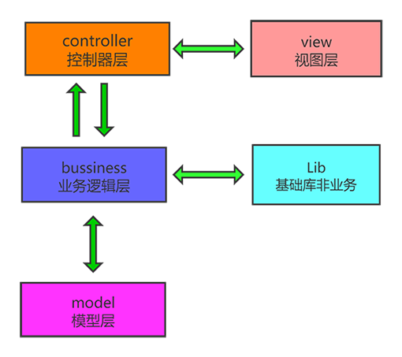

#### 前言

&emsp;&emsp;这个商城项目是基于Think PHP6框架的，前端使用的Vue框架、后端管理界面使用的开源layuiAdmin（特别感谢），后端使用的技术栈PHP+MySQL+Redis+Nginx 在主要开发。

### 项目功能介绍

#### 基础架构分层逻辑

后端使用的是五层架构，打破了传统的MVC的三层架构，把主要的业务逻辑放到了Bussiness层使得Controller层更加简洁。每一层的职责更加清晰，项目的维护成本也大大降低。

#### 用户登陆逻辑

**后端登录**

使用的是Ajax请求后端接口，其中后端登录验证主要使用到了验证码以及Cookie和Session来完成用户状态的存储

**前端登录**

前端这里使用了用户手机号获取验证码的方式登录，具体的流程如下图：

