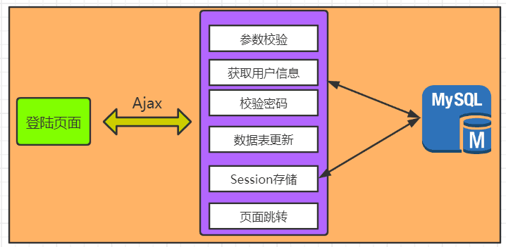
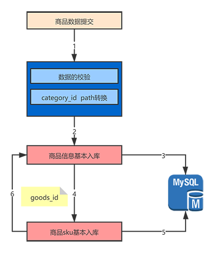
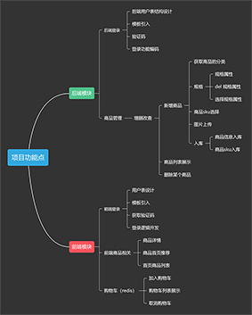

#### 前言

&emsp;&emsp;这个商城项目是基于Think PHP6框架的，前端使用的Vue框架、后端管理界面使用的开源layuiAdmin（特别感谢），后端使用的技术栈PHP+MySQL+Redis+Nginx 在主要开发。

### 前期准备

#### 路由

- HTTP方法对资源进行增、删、改、查、，方法：`GET`(查询)、`POST`(创建)、`DELETE`(删除)、`PUT`(更新)、`*`(任意的请求类型 )  
- 在路由中加入了**版本号控制**等,通信用的HTTPS安全协议的通信。
- 利用HTTP状态码来传达执行结果和失败原因。
- 查询字符串协商，返回json格式。

#### Validate(参数校验)

- 参数效验主要用的是tp5中验证器。
- 将验证器抽象出一个验证层使代码更简洁具有拦截器的作用
- 具体实现请查看：https://liruoning.cn/2019/12/31/11-tp5-validate/#mores

#### Exception(异常处理层)

异常处理在接口编写中扮演着一个不可替代的作用。
小程序中，主要将异常分为两大类：

- 由于客户的行为导致的异常。  
  **例:**  
  没有通过验证器，没有查询到结果。  
  **特性：**  
  1.通常不记录日志。    
  2.需要向用户返回具体的信息。  
- 服务器自身产生的异常。      
  **例:**  
  代码错误，调用外部接口错误。  
  **特性：**      
  1.通常记录日志  
  2.不向客户端返回具体信息。  
- 具体实现请查看：https://liruoning.cn/2020/01/02/12-tp5-Exception/   

#### 基础架构分层逻辑

后端使用的是五层架构，打破了传统的MVC的三层架构，把主要的业务逻辑放到了Bussiness层使得Controller层更加简洁。每一层的职责更加清晰，项目的维护成本也大大降低。

### 功能介绍

#### 用户登陆逻辑

**后端登录**

- 使用的是Ajax请求后端接口，其中后端登录验证主要使用到了验证码以及Cookie和Session来完成用户状态的存储
- 登录界面验证码的校验来防止XSS攻击。

**前端登录**

- 前端这里使用了用户手机号调用阿里云短信API来完成用户的登录。

#### 商品发布功能

- 在商品发布功能中完成了商品信息的入库，

- tp5完成了商品图片的上传。

- sku的多规格信息的入库完成在进行商品信息的回调。

  

#### 商品订单功能

#### 主要完成的功能(思维导图)

https://www.processon.com/view/link/5f33e7325653bb1b6121deff

